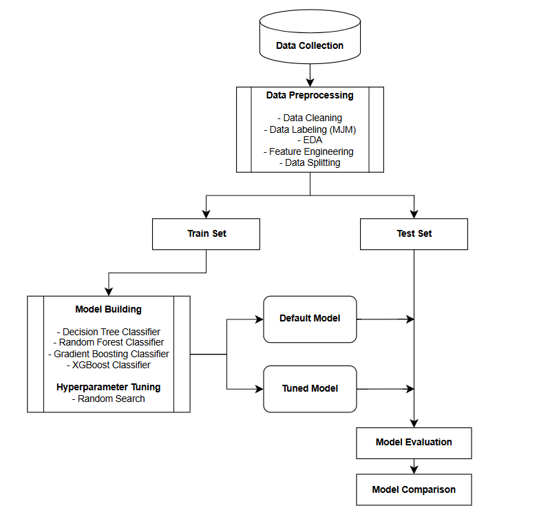
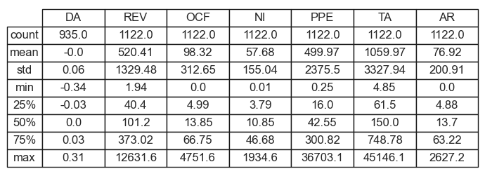
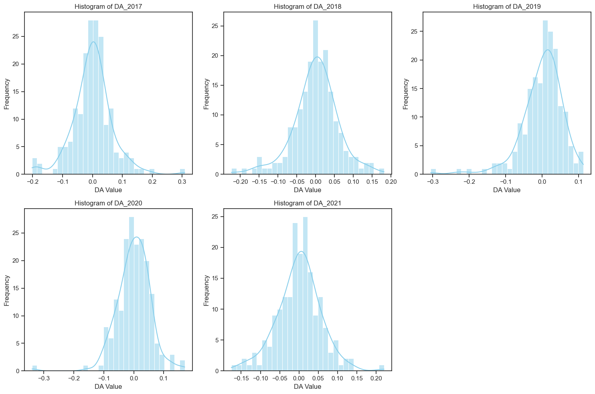
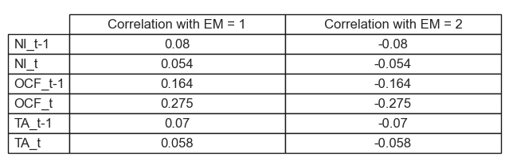
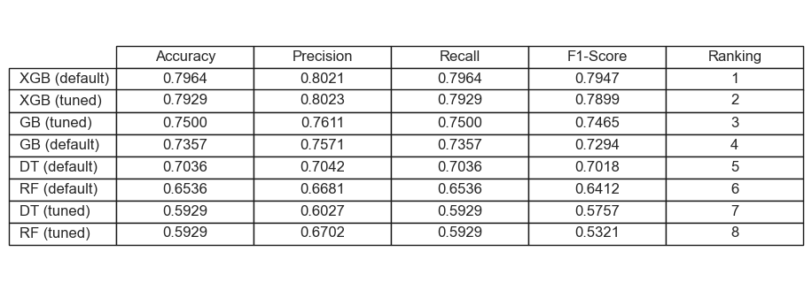
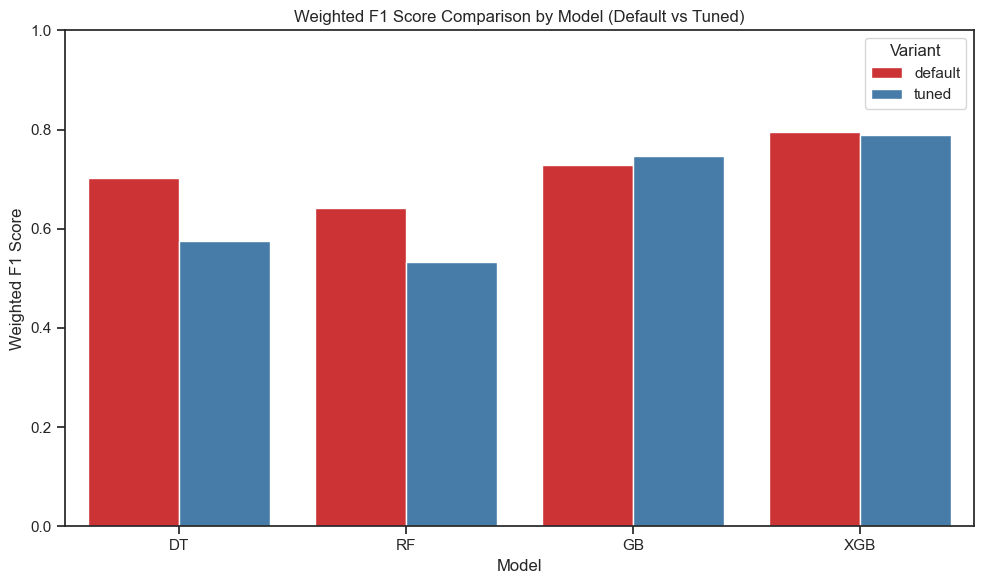

# Overview
This project applies Machine Learning to examine earnings management (EM) among Malaysian listed firms using tree-based models. It was originally developed as part of my undergraduate final semester research paper project.

Notebook with code snippet: [ML Project Notebook](EM_Detection/EM_Model.ipynb)

*Disclaimer: The EM classification is based on Modified Jones Model (MJM) discretionary accruals using S&P Capital IQ data for academic purposes only. It does not imply any financial misconduct, as all figures are derived from publicly reported financial statements.*

Research Articles refered for project design: [Reference Articles](EM_Detection/Reference.md)

# Research Question
1. Do Malaysian firms perform extreme EM over years?
2. How does firm profitability and size correlate with EM?
3. Which machine learning algorithms perform better in predicting EM?

# Tools Used
- **Python**  
    Python Libraries used: Pandas, Matplotlib, Seaborn, Scikit-learn
- **Jupyter Notebooks**
- **Visual Studio Code**
- **Git & GitHub**

# Research Design & Procedure

# Data Source
The dataset used in this study is obtained from the **S&P Capital IQ platform**. Financial statement data for firms listed on Bursa Malaysia over a six-year period (2016–2021) was extracted. 
The dataset includes the following variables:
- Net Income (NI)
- Operating Cash Flow (OCF)
- Revenue (REV)
- Total Assets (TA)
- Accounts Receivable (AR)
- Property, Plant and Equipment (PPE)

# Data Preprocessing
### Data Cleaning
- Remove missing (null) values
- Conversion of financial variables into appropriate numeric (float) format

### Data Labelling
- The Modified Jones Model (MJM) is applied to estimate discretionary accruals (DA)
- Classification thresholds are defined using DA quartiles
- Firms in the 1st and 4th quartiles are classified as exhibiting extreme negative and extreme positive earnings management, respectively
- **Final output classes:**
    - No/minimal EM → 0
    - High negative EM → 1
    - High positive EM → 2

### EDA
#### Descriptive Statistics of financial data across and discretionary accruals

The results show high dispersion in financial variables such as REV (1329.48), TA (3327.94), and PPE (2375.50), likely driven by firm size differences and cross-industry variation. In contrast, DA has a mean near zero with low variability (0.0595). While most values for variables like REV and OCF lie in the tens to hundreds range (e.g., REV Q1: 40.40, Q3: 373.02), extreme maximum values (e.g., REV: 12631.60, OCF: 4751.60) suggest strong right-skewness due to a few large firms. DA ranges from -0.3392 to 0.3083, indicating bidirectional earnings management.

#### Distribution of Discretionary Accruals Across 5 Years
  

The 2017 histogram is slightly right-skewed, indicating more firms with positive DA. In contrast, 2019 and 2020 are left-skewed, suggesting the presence of firms with unusually low (more negative) DA, indicating potential negative earnings management. Meanwhile, 2018 and 2021 show more symmetric DA distributions.

### Data Splitting
- An internal validation approach is adopted
- The dataset is split into train and test set with a 7:3 ratio

# Machine Learning Model
### Tree-Based Machine Learning Model Used:
- Decision Tree Classifier
- Random Forest Classifier
- Gradient Boosting
- Extreme Gradient Boosting

### Hyperparameter Tuning
- Random Search

### Model Evaluation
Performance Metrics used to evaluate model:
- Accuracy
- Recall (weighted average)
- Precision (weighted average)
- F1-Score (weighted average)

# The Analysis
## 1. Do Malaysian firms perform extreme EM over years?
More than one consecutive years, 94 companies among 187, are classified as implementing high negative or positive EM in more than one consecutive years.
This suggests that the practice of EM is prevalent and is implemented over years. As the data source of this study is from Bursa Malaysia listed firms, the classified EM records are considered the strategic use of accounting choices within the financial reporting standards. Although such practices are within the legal and accounting boundaries, concerns remain, as they can mislead stakeholders about a firm’s actual financial health. 

Refer list of companies: [Consecutive_EM_CompanyList](EM_Detection/consecutive_em_companies.xlsx)

## 2. How does firm profitability and size correlate with EM?
Correlation Analysis on Net Income, Operating Cash Flow and Total Assets with EM

NI and OCF reflect a firm's profitability and earning qualities, while TA represents the operational capacity of a firm. 
All three features are positively correlated with high negative EM and negatively correlated with high positive EM. OCF has the highest correlation at ±0.164 (t) and ±0.275 (t-1), indicating current year OCF has greater influence on EM than prior year OCF. In contrast, prior year NI and TA had higher correlation with EM than current year NI and TA.

A firm with strong profitability, cash flow and size may opt to conduct high negative EM (e.g. reducing current earnings) to smooth future performance or prevent overly high future expectations. In contrast, firms with lower profitability, cash flow and size may be more inclined to high positive EM (e.g. inflate current earnings), to meet performance targets or investor expectations. 

## 3. Which machine learning algorithms perform better in predicting EM?
Performance of each default and random search tuned-model

The results show that the default XGB model achieve the best overall performance, closely followed by tuned-XGB. Tuned-GB ranks third, while default GB shows slightly lower but competitive performance.

Model is ranked based on F1-score due to its ability to balance precision and recall under class imbalance. Overall, default XGB achieves the highest F1-score (0.7947), indicating the most effective trade-off between precision and recall.

Ensemble boosting methods consistently outperform single decision tree and random forest variants.

### Effect of Hyperparameter Tuning
Default and Tuned Model F1-Score Comparison

Decision Tree and Random Forest models, especially their tuned models, have relatively low F1-scores. This may be due to the underfitting of the tuned model, which will be weaker in capturing complex patterns in minority classes (high negative EM and high positive EM).

# Conclusion
This study employed tree-based machine learning models to predict EM among listed firms in Malaysia. Among the models tested, the Extreme Gradient Boost (XGB) model outperformed Gradient Boosting (GB), Random Forest (RF), and Decision Tree (DT) models. 
While hyperparameter tuning improved the performance of XGB, it had minimal impact and even led to significant performance drop in the DT and RF models. 
The correlation analysis between firm profitability and size, reflects the effort of firms to present a stable financial image. The study also reveals that about half of the Malaysian listed firms engaged in extreme EM over consecutive years.

### Project Limitation
Since the data is sourced from Malaysian listed firms, the detected EM remains within legal and accounting standards. 
Based on MJM, the study focuses only on accrual-based earnings management (AEM), meaning real earnings management (REM) is not captured and may lead to incomplete detection.
